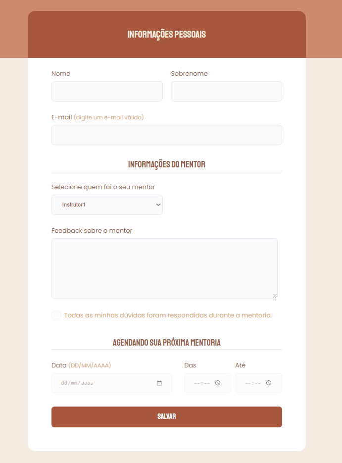

<h1 align="center"> Feedback mentor </h1>

 

  <a href="#-tecnologias">Tecnologias</a>&nbsp;&nbsp;&nbsp;|&nbsp;&nbsp;&nbsp;
  <a href="#-descrição">Descrição</a>&nbsp;&nbsp;&nbsp;|&nbsp;&nbsp;&nbsp;
  <a href="#memo-licença">Licença</a>

  

## 🚀 Tecnologias

Esse projeto foi desenvolvido com as seguintes tecnologias:

- HTML
- CSS
- Figma
- Git e Github

## 💻 Descrição

Formulário de feedback de mentores, simulando um processo de avaliação de uma mentoria!  
P.S.: Esse projeto foi baseado em um desafio do programa *Explorer* da @rocketseat.

 

  

 

## Acesse o projeto!

[Feedback mentor](https://eduvieira131.github.io/Feedback-mentor/)

 

## :memo: Licença

Esse projeto está sob a licença MIT.

---
